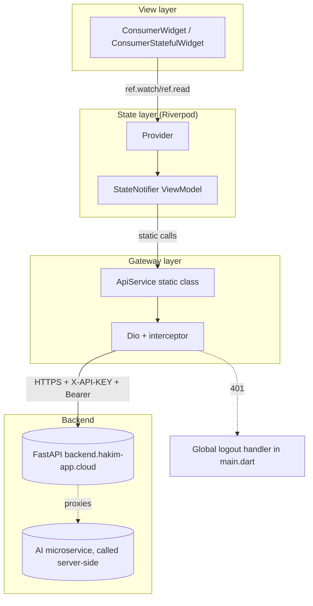
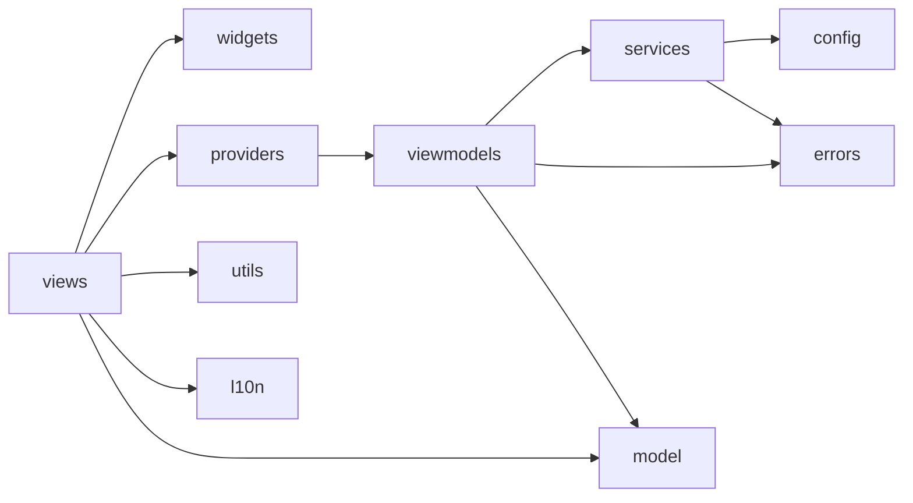
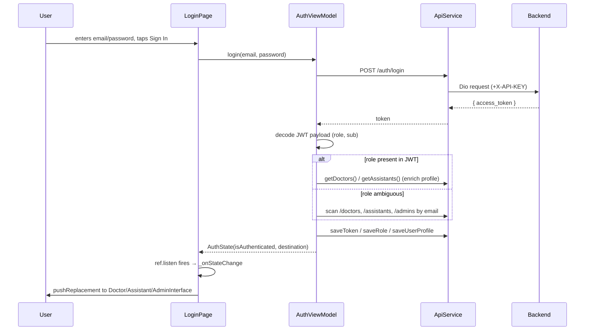
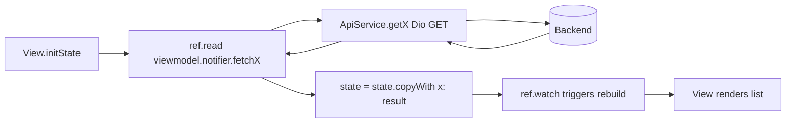
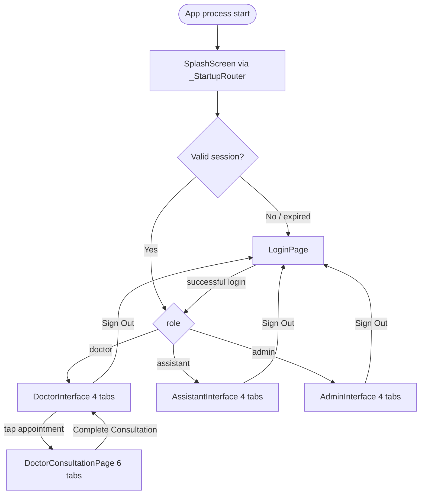

# Hakim — Architecture & Codebase Overview

*A from-scratch technical map of the Flutter client. Generated by reading the actual source tree (`lib/**/*.dart`, ~50,800 lines across 90 files) — nothing here is inferred from naming conventions alone. Where the codebase doesn't answer a question, that is stated explicitly rather than guessed.*

---

## 1. High-Level Project Overview

**Hakim** ("physician" in Arabic) is a bilingual (English/Arabic, full RTL) clinic-management mobile app for small private practices. It is a client for a FastAPI-style REST backend (`https://backend.hakim-app.cloud`) plus a second, separate AI microservice (`https://ai-api.hakim-app.cloud`, referenced in config but not yet called directly from the Flutter code — see §8) that performs voice transcription and medical-image analysis on the backend's behalf.

**Main features**

- Patient registry (create/search/edit/delete, chronic-condition tagging)
- Appointment scheduling with types, statuses, and a live calendar/day view
- A 6-tab **Consultation** workflow per visit: Vitals → Patient History → Voice-to-report (AI) → AI Medical Imaging (X-ray/skin) → Lab Reports → Manual Report
- AI-assisted medical reporting: voice recording → transcription → editable structured report; image upload → AI diagnostic draft → doctor review
- Medical report **finalization** pipeline: draft → reviewed → finalized, which triggers server-side PDF generation and WhatsApp delivery to the patient
- Lab report PDF upload/viewing per visit and per patient
- Finance/revenue dashboard for doctors (fee defaults, paid/unpaid tracking)
- Admin console: system-wide dashboard stats, user activation/deactivation, audit log browser
- Settings: password change, default fees, linked-assistant management, data export (CSV via `share_plus`), language + dark-mode toggles
- Self-service registration for Doctor and Assistant accounts, gated behind admin activation

**User roles** (mutually exclusive, resolved from the JWT at login):

| Role | Scope | Home shell |
|---|---|---|
| **Doctor** | Owns a clinic; full patient/appointment/consultation/finance access | `DoctorInterface` — 4 tabs: Dashboard, Appointments, Patients, Finance |
| **Assistant** | Linked to exactly one doctor (`doctor_id`/`doctor_email`); manages that doctor's front-desk workload | `AssistantInterface` — Dashboard, Appointments, Patients, Payments |
| **Admin** | Cross-clinic oversight; no patient/clinical data entry | `AdminInterface` — Dashboard, Users, Patients (read/moderate), Audit Logs |

**Overall architecture**

A pragmatic **two-layer MVVM**, not a full Clean-Architecture stack:

```
View (ConsumerWidget/ConsumerStatefulWidget)
   ↕  ref.watch / ref.read
ViewModel (StateNotifier<State>, one per role + one for Settings/Auth)
   ↕  static method calls
ApiService (static class wrapping a single Dio instance)
   ↕  HTTP
Backend
```

There is **no repository layer, no use-case classes, and almost no domain entity classes** — `ApiService` methods return raw `Map<String, dynamic>` / `List<dynamic>` straight from Dio, and ViewModels store those same raw maps in their state (`List<Map<String, dynamic>> patients`, etc.). The only real model classes in the app are `UserProfile`, `AppError`, `RegistrationData`, and three small view-models-only classes inside `admin_viewmodel.dart` (`AdminStats`, `AdminUser`, `AuditLog`). This is a deliberate simplicity trade-off worth knowing before you go looking for a `Patient` or `Appointment` class — there isn't one.

State management is **Riverpod** (`flutter_riverpod` `StateNotifierProvider`), theming is **per-role** (`DoctorTheme`/`AssistantTheme`/`AdminTheme` as Flutter `ThemeExtension`s), and navigation is **plain `Navigator.push`/`MaterialPageRoute`** — there is no named-route table and no `go_router`/`auto_route`.

---

## 2. Folder Structure

```
lib/
├── main.dart               entry point + startup routing
├── config/                 compile-time constants (base URLs, API key)
├── errors/                 typed error model + classifier
├── services/                two static "backend gateway" classes
├── model/                  the one shared domain model (UserProfile)
├── providers/              Riverpod provider wiring (thin, no logic)
├── viewmodels/             StateNotifier business logic, one per role
├── views/                  screens, grouped by role
│   ├── auths/
│   ├── doctor/
│   │   ├── doctor_pages/
│   │   ├── consultation/
│   │   ├── lab_reports/
│   │   └── settings/
│   ├── assistant/
│   └── admin/
├── widgets/                 reusable presentational components, by role
│   ├── doctor/ · assistant/ · shared/
├── utils/                   theming + small pure-function helpers
├── splash/                  splash screen widget
└── l10n/                    ARB source + flutter gen-l10n output
```

| Folder | Why it exists | Contains | Talks to |
|---|---|---|---|
| `config/` | One place to change environment (base URL, API key) via `--dart-define`, with hardcoded fallbacks | `app_config.dart` | Read by `API_Service.dart`, `auth_viewmodel.dart` |
| `errors/` | Centralizes "what does this exception mean to a human" so every ViewModel gives consistent, localizable-ready messages | `AppError` (typed exception), `ErrorHandler` (Dio/exception → `AppError` classifier) | Used by every ViewModel and by `API_Service.extractError()` |
| `services/` | The only code allowed to talk to `Dio`/`SharedPreferences`/`flutter_secure_storage` directly | `API_Service.dart` (all backend HTTP calls, token/role/profile persistence), `settings_service.dart` (local device prefs: fees, last tab, notification toggles) | Everything above it (ViewModels, providers) |
| `model/` | The single cross-cutting domain object that survives login → every screen | `UserProfile.dart` | Built by `auth_viewmodel.dart`, consumed by every `*Interface`/page that needs `doctorProfile`/`assistantProfile`/`adminProfile` |
| `providers/` | Wires each `StateNotifier` into the Riverpod tree; deliberately kept free of logic | One file per ViewModel + `theme_providers.dart`, `locale_provider.dart` | Read via `ref.watch`/`ref.read` from every view |
| `viewmodels/` | All business/state logic: API orchestration, pagination, caching, derived getters (search filters, counts) | `auth_viewmodel.dart`, `doctor_viewmodel.dart`, `assistant_viewmodel.dart`, `admin_viewmodel.dart`, `settings_viewmodel.dart` | Calls `ApiService`; exposes `*State` classes consumed by views |
| `views/…/*_interface.dart` | Per-role app shell: top bar, bottom nav, page switcher, logout | — | Hosts the role's page widgets; reads the role's provider |
| `views/doctor/doctor_pages/` | Doctor's 4 main tabs + profile/edit-profile + the consultation container | — | `doctor_providers.dart`, `widgets/doctor/*` |
| `views/doctor/consultation/` | The 6 tabs shown inside one active visit | — | `doctor_viewmodel.dart`, `API_Service` (uploads) |
| `views/doctor/lab_reports/` | Lab-report list (patient-wide) + PDF viewer | — | `API_Service` (upload/download), `doctor_viewmodel.dart` |
| `views/doctor/settings/` | Bottom-sheet-style settings sub-panels opened from `doctor_settings_page.dart` | — | `settings_viewmodel.dart` |
| `views/assistant/` | Assistant's dashboard/appointments/patients/payments/settings/vitals-entry | — | `assistant_providers.dart` |
| `views/admin/` | Admin dashboard/users/patients/audit-logs/settings | — | `admin_providers.dart` |
| `widgets/doctor/`, `widgets/assistant/` | Role-specific presentational components (cards, forms, avatars, chips) reused across that role's pages | — | Imported by the matching role's `views/` |
| `widgets/shared/` | The only two widgets used by more than one role | `ErrorRetryWidget`, `AppDialogs` | Imported ad hoc |
| `utils/` | Theming (`ThemeExtension` per role + the `AppThemes` aggregator) and small pure helpers | `doctor_theme.dart`, `assistant_theme.dart`, `admin_theme.dart`, `app_themes.dart`, `arabic_digits.dart`, `clinic_helpers.dart` | Read everywhere via `Theme.of(context).extension<...>()` |
| `splash/` | Pure visual splash widget (no logic) | `splash_screen.dart` | Shown by `_StartupRouter` in `main.dart` |
| `l10n/` | Source strings + generated Dart localization classes | `app_en.arb`, `app_ar.arb`, `generated/*.dart` | `AppLocalizations.of(context)` everywhere |

---

## 3. File Map

Grouped by responsibility. "Depends on" lists the significant in-repo imports (framework/package imports omitted). "Used by" is not exhaustive for widely-shared widgets (e.g. `doctor_shared_widgets.dart` is used by nearly every doctor screen).

### Core / App shell

| File | Purpose | Depends on | Used by |
|---|---|---|---|
| `main.dart` | Entry point; initializes `ApiService`, registers the global 401 handler, resolves session on cold start (`_StartupRouter`), builds `MaterialApp` | `API_Service`, `auth_viewmodel`, `settings_service`, `app_themes`, `theme_providers`, `locale_provider`, all three `*Interface`, `login_page` | — (root) |
| `splash/splash_screen.dart` | Branded splash shown while `_resolveInitialScreen()` runs | — | `main.dart` |
| `config/app_config.dart` | `backendBaseUrl`, `aiApiBaseUrl`, `apiKey`, demo admin credentials, page-size constants — all overridable via `--dart-define` | — | `API_Service`, `auth_viewmodel` |

### Errors

| File | Purpose | Depends on | Used by |
|---|---|---|---|
| `errors/app_error.dart` | `AppErrorType` enum + `AppError` exception (technical + user-facing message) | — | `error_handler.dart`, all ViewModels |
| `errors/error_handler.dart` | Classifies any exception/`DioException` into an `AppError` with a friendly message (401→session expired, 409→conflict text, 422→field-level validation text, etc.) | `app_error.dart` | `API_Service.extractError()`, every ViewModel's catch blocks |

### Services

| File | Purpose | Depends on | Used by |
|---|---|---|---|
| `services/API_Service.dart` | **The entire backend surface.** Static `Dio` client + interceptor (attaches `X-API-KEY` + Bearer token, logs requests, classifies 401 globally); ~60 methods covering auth, patients, conditions, appointments, appointment-types, visits, medical reports (+finalize), voice transcription, medical images (+review), lab reports, patient vitals, doctors/assistants/admins, dashboard stats, audit logs, plus token/role/profile persistence via `flutter_secure_storage` | `app_config.dart`, `error_handler.dart` | Every ViewModel |
| `services/settings_service.dart` | Local-only device preferences via `shared_preferences`: default consult/revisit fee, language, dark mode, notification toggles, **last-active-tab per role** (used to restore the exact tab after a process-death restart) | — | `settings_viewmodel.dart`, `locale_provider.dart`, all three `*Interface` shells |

### Model

| File | Purpose | Depends on | Used by |
|---|---|---|---|
| `model/UserProfile.dart` | The one cross-cutting user model: identity + role + clinic fields + (assistant-only) `doctorId`/`doctorEmail` cached at login to skip a discovery API call on every app start | — | Everywhere a logged-in user is displayed or scoped |

### Providers (Riverpod wiring — intentionally logic-free)

| File | Provider(s) | Notes |
|---|---|---|
| `providers/auth_providers.dart` | `authProvider`, `authLogoutCleanupProvider` | No `autoDispose`; the cleanup provider invalidates the other three role providers on logout so stale data can't leak between sessions |
| `providers/doctor_providers.dart` | `doctorViewModelProvider` | No `autoDispose` — deliberate, so navigating in/out of the consultation flow doesn't discard cached visit/report IDs |
| `providers/assistant_providers.dart` | `assistantViewModelProvider` | No `autoDispose` — deliberate, so the resolved `_linkedDoctorId` survives navigation |
| `providers/admin_providers.dart` | `adminViewModelProvider` | — |
| `providers/settings_providers.dart` | `settingsViewModelProvider` | — |
| `providers/theme_providers.dart` | `themeModeProvider`, `scaffoldMessengerKey` | Global light/dark switch + a `GlobalKey` so snackbars render above modal sheets |
| `providers/locale_provider.dart` | `localeProvider` (`LocaleNotifier`) | Restores saved language from `SettingsService` on construction |

### ViewModels

| File | State class | Purpose |
|---|---|---|
| `viewmodels/auth_viewmodel.dart` | `AuthState` | Login (decodes JWT, resolves role, builds `UserProfile`, falls back to scanning `/doctors`+`/assistants`+`/admins` if the JWT role is ambiguous), self-service registration (raw `http` POST, not Dio — see §8), logout, password-change delegation |
| `viewmodels/doctor_viewmodel.dart` (1,626 lines — largest ViewModel) | `DoctorState` | Patients/appointments/vitals CRUD + pagination, appointment-type + fee sync, visit lifecycle (`ensureVisitExists`, status transitions), voice-report text assembly (`_buildStructuredReport`), medical-image upload, **report finalization**, search/filter counters |
| `viewmodels/assistant_viewmodel.dart` (1,065 lines) | `AssistantState` | Same shape as `DoctorViewModel` but scoped to one linked doctor; `initForAssistant()` resolves `_linkedDoctorId` via profile cache → `getAssistantById` → `getAssistants()`/`getDoctors()` discovery chain (in that priority order, cheapest first) |
| `viewmodels/admin_viewmodel.dart` | `AdminState` | Dashboard stats (with client-side aggregation fallback if `/admin/dashboard/stats` is unavailable), combined doctor+assistant+admin user list with search/role/status filters, user activation toggle, paginated audit log with action/date filters |
| `viewmodels/settings_viewmodel.dart` | `SettingsState` | Preference persistence, password change, linked-assistants fetch, CSV export (patients/appointments) via `share_plus`, default-fee sync to backend appointment-types (with a create-then-recover-by-fetch fallback for 409s) |

### Auth views

| File | Purpose |
|---|---|
| `views/auths/login_page.dart` | Single login screen for all three roles; force-pins English/LTR regardless of app locale; routes post-login via `AuthState.destination` |
| `views/auths/registration_page.dart` | Tabbed Doctor/Assistant self-registration form; shows a "pending approval" screen on success (accounts start `is_active: false`) |

### Doctor — pages, consultation, lab reports, settings

| File | Purpose |
|---|---|
| `doctor_pages/doctor_interface.dart` | Shell: top bar (avatar, clock, settings), 4-tab bottom nav, page switcher, logout |
| `doctor_pages/doctor_dashboard.dart` | Overview cards, "up next" appointment, revenue-today, `fl_chart` clinic trend chart |
| `doctor_pages/doctor_appointments_page.dart` | Appointment list/calendar, filters, launches consultation |
| `doctor_pages/doctor_patients_page.dart` | Patient search/list/create |
| `doctor_pages/doctor_patient_detail.dart` (1,820 lines) | Full patient record: info, conditions, appointment history, reports, images, labs |
| `doctor_pages/doctor_finance_page.dart` | Revenue table/summary, fee visibility |
| `doctor_pages/doctor_profile_page.dart` / `doctor_edit_profile_page.dart` | View/edit the doctor's own profile |
| `doctor_pages/doctor_consultation_page.dart` (1,095 lines) | **The consultation container.** Resolves/creates the `visit`, hosts a 6-tab `TabBarView`, and owns `_save({required bool complete})` — the finalize-on-complete orchestration (see §6) |
| `doctor_pages/doctor_settings_page.dart` (1,761 lines) | Settings entry sheet; hosts sub-sheets from `views/doctor/settings/` |
| `consultation/vitals_tab.dart` | Blood pressure/pulse/temp/weight entry + condition tagging |
| `consultation/patient_history_tab.dart` (2,092 lines — largest view file) | 7 collapsible sections aggregating the patient's full history (visits, chronic diseases, medications, labs, images, prior reports, allergies) — see §5 for the allergies caveat |
| `consultation/voice_tab.dart` + `widgets/doctor/voice_recording_widget.dart` | Record → upload → transcribe audio |
| `consultation/voice_report_review_page.dart` | Editable AI-generated report draft from transcription |
| `consultation/ai_imaging_tab.dart` + `consultation/ai_imaging_review_page.dart` (1,701 lines) + `widgets/doctor/ai_analysis_result_widget.dart` | Pick/capture image → upload → AI draft (priority chain `ai_report_raw` → `ai_report` → `ai_diagnosis`) → doctor edits → staged locally until consultation completes |
| `consultation/manual_report_tab.dart` | Free-form diagnosis/medication/recommendation entry, no AI |
| `lab_reports/lab_reports_page.dart` | `LabReportsPage` (standalone) + `LabReportsTab` (embedded) — patient-wide lab PDF list, upload sheet |
| `lab_reports/lab_report_viewer_page.dart` | Downloads the PDF through the authenticated Dio client (see §8 gotcha) and opens it locally via `open_filex` |
| `settings/*.dart` | `appearance_sheet` (language/dark mode), `change_password_sheet`, `default_fees_sheet`, `linked_assistants_sheet`, `reports_export_sheet`, `settings_sheet_helpers` (shared bottom-sheet chrome) |

### Assistant views

| File | Purpose |
|---|---|
| `assistant_interface.dart` | Shell; wraps its subtree in the Assistant `Theme` explicitly (dialogs/sheets sit outside the normal widget tree, so they re-wrap manually) |
| `assistant_dashboard.dart` | Today's appointments, quick stats for the linked doctor |
| `assistant_appointments_page.dart` | Booking, check-in, payment toggle |
| `assistant_patients_page.dart` | Patient list/search/create (delegates detail rendering to `widgets/assistant/assistant_patient_detail.dart`) |
| `assistant_vitals_page.dart` | Assistant-side vitals entry (pre-consultation) |
| `assistant_payments_page.dart` | Paid/unpaid appointment ledger |
| `assistant_edit_profile_page.dart` | Edit own profile |
| `assistant_settings_page.dart` (1,885 lines) | Settings sheet + linked-doctor info + export sheet, all as private classes in one file |
| `views/assistant/assistant_patient_detail.dart` | ⚠️ **Dead file.** Same class name/content lineage as `widgets/assistant/assistant_patient_detail.dart` but nothing in the codebase imports this copy — only the `widgets/` version is imported by `assistant_patients_page.dart`. Safe to delete, but out of scope for this read-only report. |

### Admin views

| File | Purpose |
|---|---|
| `admin_interface.dart` | Shell; indigo `AdminTheme` |
| `admin_dashboard.dart` | 6-card stats grid (patients/doctors/assistants/admins/active/inactive), loading skeletons, retry-on-error |
| `admin_users_page.dart` | Tabbed doctor/assistant/admin list, search, role/status filters, activate/deactivate |
| `admin_patients_page.dart` | Read/moderate patient records system-wide |
| `admin_audit_logs_page.dart` (975 lines) | Paginated, filterable (action/date) audit trail |
| `admin_settings_page.dart` (1,116 lines) | Profile (read-only), change password, appearance, sign out — deliberately excludes fee/assistant sections that don't apply to Admin |

### Widgets

| Folder | Files | Purpose |
|---|---|---|
| `widgets/doctor/` | `doctor_shared_widgets`, `doctor_pat_card`, `doctor_appt_card`, `doctor_appt_form`, `doctor_pat_form`, `doctor_appt_details_sheet`, `doctor_consultation_widgets`, `image_upload_widget`, `ai_analysis_result_widget`, `voice_recording_widget` | Cards, forms, and consultation-specific presentational pieces reused across doctor pages |
| `widgets/assistant/` | `assistant_shared_widgets`, `assistant_pat_card`, `assistant_appt_card`, `assistant_pat_form`, `assistant_appt_form`, `assistant_patient_detail` | Assistant equivalents of the above |
| `widgets/shared/` | `error_retry_widget`, `app_dialogs` | The only widgets shared across more than one role |

### Utils

| File | Purpose |
|---|---|
| `utils/doctor_theme.dart` / `assistant_theme.dart` / `admin_theme.dart` | Per-role `ThemeExtension` (light+dark token sets) + a static brand-color/gradient bag (`DoctorTheme`, `AssistantTheme`, `AdminTheme`) |
| `utils/app_themes.dart` (1,293 lines) | Builds the two global `ThemeData` objects (`AppThemes.light`/`.dark`) and registers all three theme extensions on each |
| `utils/arabic_digits.dart` | Converts Western digits to Arabic-Indic digits for Arabic locale display |
| `utils/clinic_helpers.dart` | Small pure formatting/lookup helpers shared by Doctor and Assistant ViewModels |

### Localization

| File | Purpose |
|---|---|
| `l10n/app_en.arb` / `app_ar.arb` | Source strings (English/Arabic) |
| `l10n/generated/app_localizations*.dart` | Generated by `flutter gen-l10n` (configured via `l10n.yaml`, invoked automatically because `generate: true` in `pubspec.yaml`) — do not hand-edit |

---

## 4. Entry Point

`main.dart` → `main()`:

1. `ApiService.init()` — constructs the single `Dio` instance (base URL, timeouts, the `X-API-KEY` + Bearer-token request interceptor, response/error logging, and global 401 handling).
2. `ApiService.registerUnauthorizedHandler(...)` — wires a callback that resets `AuthViewModel`'s static instance and force-navigates to `LoginPage` whenever *any* API call anywhere in the app returns 401.
3. `runApp(ProviderScope(child: MyApp()))`.

`MyApp.build()` watches `themeModeProvider` and `localeProvider`, builds one `MaterialApp` with `home: const _StartupRouter()`.

`_StartupRouter` (private, stateful) shows `SplashScreen` immediately, then in `initState` calls `_resolveInitialScreen()`:

1. Read `token`, `role`, `userProfile` from secure storage (`ApiService`).
2. If any is missing, or the JWT's `exp` claim has passed (`_isTokenExpired`, decoded client-side without a crypto library — just base64url + JSON), → `LoginPage`.
3. Otherwise rebuild a `UserProfile` from the cached profile map (including `doctorId`/`doctorEmail` for assistants, so the expensive doctor-discovery lookup is skipped on warm restarts).
4. Read the last-active tab index for that role from `SettingsService` (defaults to tab 1 — Appointments — for assistants, tab 0 for everyone else).
5. Return `DoctorInterface` / `AssistantInterface` / `AdminInterface` pre-seeded with that profile and tab index.

The router then `pushReplacement`s from the splash to that destination with a 300 ms fade — the splash is never seen again for the rest of the process lifetime (warm resumes don't re-run `main()`).

---

## 5. Feature Breakdown

| Feature | Folders | Main screens | ViewModel / Provider | Models | Services / APIs |
|---|---|---|---|---|---|
| **Authentication** | `views/auths/`, `viewmodels/auth_viewmodel.dart` | `LoginPage`, `RegistrationPage` | `AuthViewModel` / `authProvider` | `UserProfile`, `RegistrationData` | `POST /auth/login`, `POST /users/doctors/register`, `POST /users/assistants/register` (raw `http`, not Dio — see §8), `POST /auth/logout`, `POST /auth/change-password` |
| **Doctor dashboard** | `views/doctor/doctor_pages/doctor_dashboard.dart` | `DoctorDashboardPage` | `DoctorViewModel` | — | Aggregates already-loaded patients/appointments state; `fl_chart` for the trend graph |
| **Patients** | `views/doctor/doctor_pages/{doctor_patients_page,doctor_patient_detail}.dart`, `views/assistant/{assistant_patients_page,...}`, `views/admin/admin_patients_page.dart` | Role-specific patient list/detail pages | `DoctorViewModel`/`AssistantViewModel`/`AdminViewModel` | — | `/clinic/patients` (CRUD), `/clinic/conditions` (assign/remove) |
| **Appointments** | `doctor_pages/doctor_appointments_page.dart`, `assistant/assistant_appointments_page.dart` | Both role variants | `DoctorViewModel`/`AssistantViewModel` | — | `/clinic/appointments`, `/clinic/appointment-types` |
| **Consultation / Visits** | `views/doctor/consultation/*`, `doctor_pages/doctor_consultation_page.dart` | `DoctorConsultationPage` + 6 tabs | `DoctorViewModel` | — | `/clinic/visits`, `/clinic/patient-vitals` |
| **AI Voice Reporting** | `consultation/voice_tab.dart`, `consultation/voice_report_review_page.dart`, `widgets/doctor/voice_recording_widget.dart` | `VoiceTab` → `VoiceReportReviewPage` | `DoctorViewModel` | — | `record` package (capture) → `POST /reports/transcribe` (multipart) → `POST /reports/medical-reports` → `PATCH .../status` |
| **AI Medical Imaging** | `consultation/ai_imaging_tab.dart`, `consultation/ai_imaging_review_page.dart`, `widgets/doctor/ai_analysis_result_widget.dart` | `AIImagingTab` → `AIImagingReviewPage` | `DoctorViewModel` (via `ensureVisit` callback) | — | `image_picker` → `POST /reports/medical-images` (multipart) → `PATCH /reports/medical-images/{id}/review` (deferred to consultation completion) |
| **Manual Reports** | `consultation/manual_report_tab.dart` | `ManualReportTab` | `DoctorViewModel` | — | `POST /reports/medical-reports`, `PATCH .../status` |
| **Report Finalization** | `doctor_pages/doctor_consultation_page.dart` (`_save`) | — | `DoctorViewModel.finalizeReport` | — | `POST /reports/medical-reports/{id}/finalize` (120s timeout — synchronous PDF+WhatsApp) |
| **Lab Reports** | `views/doctor/lab_reports/*` | `LabReportsPage`/`LabReportsTab`, `LabReportViewerPage` | `DoctorViewModel` | — | `POST /reports/lab-reports` (multipart PDF), `GET /reports/visits/{id}/lab-reports`, authenticated download via `ApiService.downloadStoredFile` |
| **Patient History (in-consultation)** | `consultation/patient_history_tab.dart` | `PatientHistoryTab` | `DoctorViewModel` | — | Parallel fetch of visits, medical reports, medical images (all patient-scoped) + per-visit lab reports |
| **Finance** | `doctor_pages/doctor_finance_page.dart`, `assistant/assistant_payments_page.dart` | Role variants | `DoctorViewModel`/`AssistantViewModel` | — | Derived from appointment `fee`/`is_paid` fields — no dedicated finance endpoint |
| **Admin console** | `views/admin/*` | Dashboard, Users, Patients, Audit Logs | `AdminViewModel` | `AdminStats`, `AdminUser`, `AuditLog` | `/admin/dashboard/stats`, `/users/doctors`, `/users/assistants`, `/users/admins`, `PATCH /users/users/{id}/status`, `/reports/audit-logs` |
| **Settings** | `doctor_pages/doctor_settings_page.dart`, `doctor/settings/*`, `assistant_settings_page.dart`, `admin_settings_page.dart` | Bottom-sheet stacks per role | `SettingsViewModel` (doctor path) / inline state (assistant, admin) | — | `SettingsService` (local), `ApiService.changePassword`, `getAppointmentTypes`/`updateAppointmentType` (fee sync) |
| **Localization / Theming** | `l10n/*`, `utils/*_theme.dart`, `providers/{locale_provider,theme_providers}.dart` | — | `LocaleNotifier`, `themeModeProvider` | — | `shared_preferences` |

---

## 6. Data Flow

Standard direction (e.g. loading the patient list):

```
View (initState / user action)
    → ref.read(doctorViewModelProvider.notifier).fetchPatients()
        → ApiService.getPatients(...)                      // Dio GET
            → Backend
            ← JSON response
        ← List<dynamic> (raw maps)
    ← state = state.copyWith(patients: [...])               // StateNotifier
View rebuilds automatically (ref.watch(doctorViewModelProvider))
```

No manual `setState` round-trip is needed for data screens — Riverpod's `ref.watch` triggers the rebuild whenever `copyWith` produces a new `DoctorState`/`AssistantState`/`AdminState`.

The one workflow worth tracing end-to-end because it crosses several files is **consultation completion**, since it's the most business-logic-heavy path in the app:

```
DoctorConsultationPage._save(complete: true)
  1. Resolve/confirm the active visit (ensureVisitExists)
  2. If a voice or manual report exists in DRAFT/REVIEWED state:
       DoctorViewModel.finalizeReport(reportId)
         → if status == DRAFT: ApiService.updateReportStatus(id, 'REVIEWED')
         → ApiService.finalizeReport(id)   // POST .../finalize, 120s timeout
              (backend generates PDF + sends WhatsApp — fire-and-forget on the
               backend side; the report is FINALIZED even if WhatsApp fails)
  3. Submit any staged AI-imaging confirmations:
       ApiService.reviewMedicalImage(imageId, diff)  // once per image
  4. ApiService.updateVisitStatus(visitId, 'COMPLETED')
  5. ApiService.updateAppointmentStatus(appointmentId, 'COMPLETED')
  6. DoctorViewModel.fetchAppointments()  // refresh the list
```

Imaging-only consultations (no voice/manual report) skip step 2 entirely — there is no "anchor" empty report created for them (a follow-up fix removed that, since it caused a duplicate WhatsApp send).

---

## 7. State Management

- **Solution:** `flutter_riverpod` (`^2.5.1`), specifically `StateNotifierProvider` + `StateNotifier<T>` for every stateful feature, plus a couple of plain `StateProvider`s (`themeModeProvider`) and one hand-rolled `StateNotifier` for locale.
- **Initialization:** `ProviderScope` wraps the whole app in `main()`. No provider overrides are used anywhere (no test/mock wiring present).
- **Classes that manage state:** `AuthViewModel`, `DoctorViewModel`, `AssistantViewModel`, `AdminViewModel`, `SettingsViewModel`, `LocaleNotifier` — each pairs with an immutable `*State` class exposing a `copyWith`.
- **UI updates:** Views are `ConsumerWidget`/`ConsumerStatefulWidget`; they call `ref.watch(xProvider)` to rebuild on state change and `ref.read(xProvider.notifier).method()` to trigger actions. `ref.listen` is used where a side effect (navigation) must run once, outside `build` (e.g. `login_page.dart` navigating after `AuthState.isAuthenticated` flips).
- **Lifecycle choice:** none of the four role/auth providers use `autoDispose`. This is called out explicitly in three of the four provider files' own comments — the trade-off is intentional (state survives navigation so cached IDs/lookups aren't repeated), at the cost of stale state needing manual invalidation on logout, which `authLogoutCleanupProvider` handles.
- **Local-only UI state** (selected tab index, form controllers, animation controllers) stays as plain `State`/`setState` inside the relevant widget — it is not lifted into Riverpod.

---

## 8. API Layer

- **Single gateway:** `lib/services/API_Service.dart` — a static class, one `Dio` instance (`_dio`), ~60 endpoint methods. Nothing else in the app is allowed to import `dio` directly for backend calls — the one exception is `auth_viewmodel.dart`, which uses the raw `http` package (not `_dio`) for the two self-registration endpoints, bypassing the shared interceptor. This means registration calls do **not** get the standardized error-detail extraction or the 401 handler; they parse `response.body`/status code manually.
- **Dio configuration:** base URL from `AppConfig.backendBaseUrl` (default `https://backend.hakim-app.cloud`, overridable via `--dart-define=BACKEND_BASE_URL=...`), 30s connect / 60s receive timeout (bumped to 120s specifically for `finalizeReport`), JSON content-type default.
- **Interceptor (`InterceptorsWrapper`):**
  - `onRequest`: injects `X-API-KEY` (from `AppConfig.apiKey`) on every request, and `Authorization: Bearer <token>` when a token is present in secure storage; logs method/URI/params/body.
  - `onResponse`: logs status + URI.
  - `onError`: extracts a readable `detail` from FastAPI-style error bodies (handles both string and field-list `detail` shapes), replaces the `DioException`'s message with that readable string, and — critically — on a **401** calls `_handleUnauthorized()`, which clears token/role/profile and invokes the app-wide callback registered in `main()` (navigate to `LoginPage`), guarded by a `_handlingUnauthorized` flag so concurrent 401s don't fire the redirect twice.
- **Base URL / API key location:** `lib/config/app_config.dart` — all four values (`backendBaseUrl`, `aiApiBaseUrl`, `apiKey`, demo admin credentials) are `String.fromEnvironment` with hardcoded fallbacks, meaning the production API key currently ships baked into the client binary as a fallback constant.
- **`aiApiBaseUrl`:** defined in config but **not referenced anywhere else in the Flutter codebase** — voice transcription and image analysis are called through the *main* backend (`/reports/transcribe`, `/reports/medical-images`), which presumably proxies to the AI service server-side. Worth confirming with the backend team if this constant is meant for a future direct-to-AI path.
- **Authentication flow:** `POST /auth/login` → JWT stored via `flutter_secure_storage` (`access_token` key) → role decoded client-side from the JWT payload (`role`/`user_role`/`type` claim, base64url-decoded manually, **not cryptographically verified** — the app trusts the payload's shape but never checks the signature, which is fine since it never uses claims for authorization decisions, only for UI routing) → profile enriched by cross-referencing `/users/doctors` or `/users/assistants` by email → everything persisted (`saveToken`/`saveRole`/`saveUserProfile`) for session restore.
- **Token storage:** `flutter_secure_storage`, three keys: `access_token`, `user_role`, `user_profile` (the last one is a JSON-encoded blob of the whole `UserProfile`, not just an ID — a deliberate optimization so cold start doesn't need a network call to redraw the UI).
- **Error handling:** `errors/error_handler.dart` classifies every exception (network, timeout, 401/403/404/409/422/5xx, or unknown) into an `AppError` with both a `technical` (log-only) and `userMessage` (display-ready) string. `ApiService.extractError(e)` is the ViewModel-facing convenience wrapper around this.

---

## 9. Models

| Model | Represents | Built from / used by | Screens that depend on it |
|---|---|---|---|
| `UserProfile` (`model/UserProfile.dart`) | The logged-in user across all three roles, including assistant→doctor linkage fields | Built in `AuthViewModel._buildProfile` from login/doctor/assistant API responses; restored from secure storage on cold start | Every `*Interface`, profile/edit-profile pages, appointment/consultation forms that need `doctorId` |
| `RegistrationData` (`viewmodels/auth_viewmodel.dart`) | The self-registration form payload for either role | `RegistrationPage` → `AuthViewModel.register()` | `RegistrationPage` |
| `AppError` / `AppErrorType` (`errors/app_error.dart`) | A classified, typed exception carrying a user-safe message | `ErrorHandler.parse()` | All ViewModels' catch blocks; some views read `.userMessage` directly |
| `AdminStats` (`viewmodels/admin_viewmodel.dart`) | Aggregate counts for the admin dashboard | `GET /admin/dashboard/stats`, or client-side aggregation fallback | `AdminDashboard` |
| `AdminUser` (`viewmodels/admin_viewmodel.dart`) | A normalized doctor/assistant/admin row for the user-management table; distinguishes the profile-table PK (`id`) from the users-table PK (`userId`) needed for status updates | `GET /users/{doctors,assistants,admins}` | `AdminUsersPage` |
| `AuditLog` (`viewmodels/admin_viewmodel.dart`) | One audit-trail entry, tolerant of several possible backend field-name variants (`user_email`/`email`/`actor_email`/…) | `GET /reports/audit-logs` | `AdminAuditLogsPage` |

**Everything else — Patient, Appointment, Visit, MedicalReport, MedicalImage, LabReport, Vitals, AppointmentType, Doctor, Assistant, Admin (as a user list) — is passed around as `Map<String, dynamic>` / `List<dynamic>`, never wrapped in a typed class.** This is consistent across every ViewModel and every widget's field access (e.g. `appointment['patient_first_name']`). It is the single biggest architectural characteristic to internalize before making changes: there is no compiler-enforced schema for these objects, and field-name mismatches between frontend expectations and backend responses (several are called out in code comments, e.g. the lab-report `report_url` vs `report_file` fix) are a recurring source of bugs precisely because of this.

---

## 10. Navigation

- **Routing system:** none of the router packages — plain `Navigator.push(context, MaterialPageRoute(builder: ...))` for drill-in navigation, and `Navigator.pushReplacement`/`pushAndRemoveUntil` for full-stack swaps (login → role shell, logout → login, session-expired → login).
- **Initial route:** decided imperatively in `main.dart`'s `_resolveInitialScreen()` (see §4) — not a named route, a widget returned by a function.
- **Named routes:** not used. `MaterialApp` has no `routes:`/`onGenerateRoute:` table.
- **Role-based navigation:** each role has its own shell widget (`DoctorInterface`/`AssistantInterface`/`AdminInterface`) that owns a bottom `TabBar`-style nav rendered manually (not Flutter's `BottomNavigationBar` widget, but a hand-built `Row` of `InkWell`s per file, e.g. `doctor_interface.dart`'s `_buildBottomNav`). The selected index is local `State`, persisted per-role via `SettingsService.setLastTab(role, index)` so a killed-and-restarted process reopens on the same tab. Switching roles only happens by logging out and back in — there's no cross-role navigation.
- **Sub-navigation within consultation:** a `TabController`-driven `TabBarView` (6 tabs, `NeverScrollableScrollPhysics` — tabs are only reachable via the `TabBar`, not swipe).

---

## 11. Dependency Graph

```
main.dart
  ├─ ApiService.init()  (Dio + interceptor, one-time)
  └─ ProviderScope
       └─ MyApp (watches themeModeProvider, localeProvider)
            └─ _StartupRouter → resolves session → one of:
                 DoctorInterface / AssistantInterface / AdminInterface
                      │
                      ├─ Providers (doctorViewModelProvider, etc.)
                      │      └─ ViewModel (StateNotifier)
                      │             └─ ApiService (static)
                      │                    └─ Dio → Backend
                      │
                      └─ Views (role pages)
                           └─ Widgets (role-specific presentational components)
                                └─ Theme extensions (utils/*_theme.dart)
                                     via AppThemes.light / AppThemes.dark
```

Cross-cutting, read from (almost) every layer: `l10n/generated/app_localizations.dart` (via `AppLocalizations.of(context)`), `errors/*` (via ViewModel catch blocks).

---

## 12. Learning Order

Fastest path to a working mental model of this specific codebase:

1. `main.dart` — startup + session resolution
2. `config/app_config.dart` + `services/API_Service.dart` — what the backend actually looks like from the client's point of view
3. `errors/app_error.dart` + `errors/error_handler.dart` — how failures are surfaced everywhere else
4. `model/UserProfile.dart` — the one shared identity object
5. `viewmodels/auth_viewmodel.dart` + `views/auths/login_page.dart` — login → role resolution → routing
6. `providers/doctor_providers.dart` → `viewmodels/doctor_viewmodel.dart` (`DoctorState` first, then the CRUD methods) — the template every other ViewModel follows
7. `views/doctor/doctor_pages/doctor_interface.dart` — how a role shell wires provider + tabs + theme together
8. `views/doctor/doctor_pages/{doctor_patients_page,doctor_appointments_page}.dart` — the standard list/search/paginate/create pattern, reused everywhere
9. `views/doctor/doctor_pages/doctor_consultation_page.dart` — the most complex single screen; read it *after* step 6 so `ensureVisitExists`/`finalizeReport` calls make sense
10. `views/doctor/consultation/*` (vitals → voice → imaging → lab → manual → history, in that tab order)
11. `viewmodels/assistant_viewmodel.dart` — mostly a mirror of step 6, focus on `initForAssistant()`'s doctor-resolution chain, which is the one genuinely new idea
12. `viewmodels/admin_viewmodel.dart` + `views/admin/*` — smallest, most self-contained role; good for confirming the pattern rather than learning it
13. `viewmodels/settings_viewmodel.dart` + `views/doctor/settings/*` — cross-cutting preferences, touches almost every backend area briefly
14. `utils/app_themes.dart` + one of `doctor_theme.dart`/`assistant_theme.dart`/`admin_theme.dart` — theming mechanics
15. `l10n/app_en.arb` — skim to understand the localization key vocabulary, don't read the generated Dart

---

## 13. Files Ranked by Importance

Ranked for "read this to actually understand the app," not by line count alone.

| # | File | Reason | Difficulty | Depends on |
|---|---|---|---|---|
| 1 | `lib/services/API_Service.dart` | Defines the entire backend contract the rest of the app is built against | Medium | `app_config`, `error_handler` |
| 2 | `lib/main.dart` | Entry point, session bootstrap, global 401 wiring | Low | Almost everything (imports) |
| 3 | `lib/viewmodels/doctor_viewmodel.dart` | Largest, most representative business-logic file; the template for the other three ViewModels | High | `API_Service`, `settings_service`, `clinic_helpers` |
| 4 | `lib/viewmodels/auth_viewmodel.dart` | Login/registration/role-resolution logic, including the JWT-decode-and-fallback-scan pattern | Medium | `API_Service`, `error_handler`, `UserProfile` |
| 5 | `lib/views/doctor/doctor_pages/doctor_consultation_page.dart` | The core clinical workflow screen; ties together visits, 6 tabs, and report finalization | High | `doctor_viewmodel`, all `consultation/*` tabs |
| 6 | `lib/model/UserProfile.dart` | Small but load-bearing — every screen that shows "who is logged in" depends on it | Low | — |
| 7 | `lib/errors/error_handler.dart` | Explains why error messages look the way they do everywhere | Low | `app_error` |
| 8 | `lib/errors/app_error.dart` | The typed-error vocabulary used across every catch block | Low | — |
| 9 | `lib/viewmodels/assistant_viewmodel.dart` | Second-largest ViewModel; the doctor-linkage resolution chain is the one truly assistant-specific idea | High | `API_Service`, `UserProfile`, `clinic_helpers` |
| 10 | `lib/config/app_config.dart` | Tiny, but explains every base URL / key you'll see logged | Low | — |
| 11 | `lib/views/doctor/consultation/patient_history_tab.dart` | Largest single view file; shows the "aggregate several endpoints into one screen" pattern | High | `doctor_viewmodel`, `API_Service` |
| 12 | `lib/views/doctor/doctor_pages/doctor_interface.dart` | Canonical example of a role shell (top bar + tabs + theme + logout) | Low | `doctor_providers`, `doctor_theme` |
| 13 | `lib/viewmodels/admin_viewmodel.dart` | Compact but introduces the profile-PK vs users-table-PK distinction (`AdminUser.statusUpdateId`) | Medium | `API_Service` |
| 14 | `lib/views/auths/login_page.dart` | Shows the `ref.listen`-for-navigation pattern and the forced-English-locale override | Medium | `auth_providers`, all three `*Interface` |
| 15 | `lib/providers/auth_providers.dart` | Small file, but explains the cross-provider logout-invalidation pattern | Low | `auth_viewmodel`, other providers |
| 16 | `lib/views/doctor/consultation/ai_imaging_review_page.dart` | The most intricate single interaction (stage-locally-then-submit-once-at-finalize) | High | `API_Service`, `doctor_viewmodel`, `ai_analysis_result_widget` |
| 17 | `lib/viewmodels/settings_viewmodel.dart` | Shows the create-then-recover-by-fetch pattern for syncing fee defaults to appointment-types | Medium | `API_Service`, `settings_service` |
| 18 | `lib/views/doctor/lab_reports/lab_report_viewer_page.dart` | The authenticated-download-then-open-locally pattern (needed for *any* backend-hosted file) | Medium | `API_Service` |
| 19 | `lib/utils/app_themes.dart` | Explains how three role themes coexist inside two global `ThemeData`s | Medium | `doctor_theme`, `assistant_theme`, `admin_theme` |
| 20 | `lib/views/doctor/doctor_pages/doctor_dashboard.dart` | Good example of composing already-loaded ViewModel state into charts/cards | Medium | `doctor_viewmodel`, `fl_chart` |
| 21 | `lib/views/assistant/assistant_interface.dart` | Shows the "re-wrap dialogs in Theme manually" gotcha | Low | `assistant_providers`, `assistant_theme` |
| 22 | `lib/views/admin/admin_users_page.dart` | Standard filtered/searchable list pattern, admin variant | Medium | `admin_viewmodel` |
| 23 | `lib/views/doctor/consultation/voice_report_review_page.dart` | AI-draft-review UX pattern (mirrored by the imaging review page) | Medium | `doctor_providers`, `API_Service` |
| 24 | `lib/views/doctor/consultation/manual_report_tab.dart` | Simplest of the three report-entry tabs — good baseline before reading voice/imaging | Low | `doctor_viewmodel`, `API_Service` |
| 25 | `lib/views/doctor/doctor_pages/doctor_patient_detail.dart` | Largest patient-facing screen; aggregates conditions/appointments/reports/images/labs | High | `doctor_viewmodel`, `API_Service` |
| 26 | `lib/providers/assistant_providers.dart` | One line of provider wiring, but the file comment explains *why* no `autoDispose` — read once, apply everywhere | Low | `assistant_viewmodel` |
| 27 | `lib/views/admin/admin_audit_logs_page.dart` | Pagination + multi-filter UI pattern at its most developed | Medium | `admin_viewmodel` |
| 28 | `lib/utils/clinic_helpers.dart` | Small helper file shared by both clinical ViewModels — worth knowing exists before duplicating logic | Low | — |
| 29 | `lib/views/doctor/doctor_pages/doctor_settings_page.dart` | Largest settings file; shows the bottom-sheet-of-bottom-sheets composition style | High | `settings_viewmodel`, all `doctor/settings/*` |
| 30 | `lib/l10n/app_en.arb` | Not Dart, but the fastest way to see every user-facing string key the app defines | Low | — |

---

## 14. Diagrams

### Overall Architecture



### Folder Relationships



### Login Flow



### Data Flow (typical list screen)



### Navigation Flow



---

## Notes on report scope

Per the task rules, this document is analysis-only — no code was modified, refactored, or generated. Two observations surfaced during the read that a maintainer may want to act on separately (not acted on here):

1. `lib/views/assistant/assistant_patient_detail.dart` appears to be an unused duplicate of `lib/widgets/assistant/assistant_patient_detail.dart` — only the `widgets/` copy is imported anywhere.
2. `AppConfig.aiApiBaseUrl` is defined but never referenced by any other file in `lib/` — confirm with the backend team whether a direct-to-AI client path is planned.
